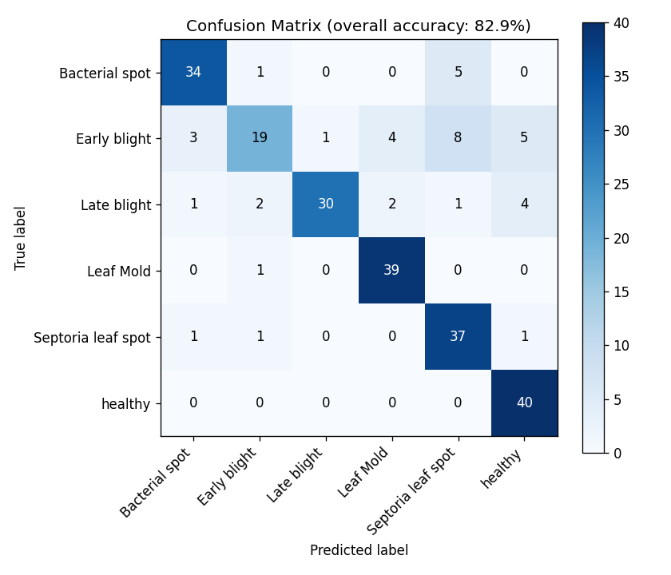
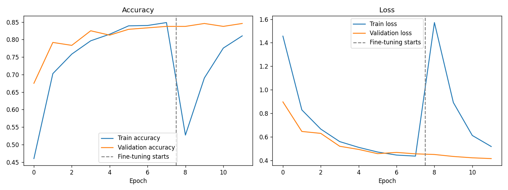

# 🍅 Tomato Leaf Disease Classifier

פרויקט **Computer Vision / Image Classification** מקצה לקצה: מודל שמזהה
מחלות בעלי עגבנייה מתוך תמונה, ואפליקציית דמו חיה שאפשר להתנסות בה
ולהראות למראיינים. נבנה כפרויקט פורטפוליו למי שמתחיל בתחום ה-ML ורוצה
משהו אמיתי (לא עוד "Iris dataset") להראות בחיפוש עבודה.

> 📖 **מתחילים?** קראו את `docs/INTERVIEW_PREP.md` - מדריך מלא איך
> להציג את הפרויקט הזה בראיונות עבודה, כולל תשובות לשאלות טכניות נפוצות.

---

## מה הפרויקט עושה

מעלים תמונה של עלה עגבנייה -> המודל מחזיר אחת מ-6 תחזיות:

| קלאס | תיאור |
|---|---|
| `Tomato___healthy` | עלה בריא |
| `Tomato___Late_blight` | כשות מאוחרת |
| `Tomato___Early_blight` | כשות מוקדמת |
| `Tomato___Leaf_Mold` | עובש עלים |
| `Tomato___Septoria_leaf_spot` | כתמי ספטוריה |
| `Tomato___Bacterial_spot` | כתמים חיידקיים |

## התוצאות

לאחר אימון, המודל השיג **82.9%** דיוק (accuracy) על סט בדיקה (test set)
שמעולם לא נראה באימון - 240 תמונות, 6 קלאסים מאוזנים (40 לכל קלאס).
לשם השוואה, ניחוש אקראי בין 6 קלאסים היה נותן כ-16.7% - כלומר המודל
לומד בבירור דפוסים אמיתיים, לא מנחש.

| קלאס | Precision | Recall | F1 |
|---|---|---|---|
| בריא (healthy) | 0.80 | 1.00 | 0.89 |
| כשות מאוחרת (Late Blight) | 0.97 | 0.75 | 0.85 |
| עובש עלים (Leaf Mold) | 0.87 | 0.97 | 0.92 |
| כתמים חיידקיים (Bacterial Spot) | 0.87 | 0.85 | 0.86 |
| כתמי ספטוריה (Septoria) | 0.73 | 0.93 | 0.81 |
| כשות מוקדמת (Early Blight) | 0.79 | 0.47 | 0.59 |

הקלאס החלש ביותר הוא Early Blight (recall נמוך יחסית) - המודל מתבלבל
בינו לבין קלאסים דומים ויזואלית. זו בדיוק הדוגמה שמראיינים אוהבים
לשמוע: לא רק "המודל עובד", אלא ניתוח *איפה* הוא נכשל ולמה (ראו
`docs/INTERVIEW_PREP.md`). פירוט מלא ב-`models/metrics.json`, ומטריצת
בלבול חזותית ב-`models/confusion_matrix.png`.




## ארכיטקטורה וגישה

- **מודל**: MobileNetV2 (מאומן מראש על ImageNet) + Transfer Learning
- **דאטהסט**: תת-קבוצה (2,400 תמונות, 6 קלאסים) מתוך
  [PlantVillage Dataset](https://github.com/spMohanty/PlantVillage-Dataset) -
  תמונות אמיתיות, לא סינתטיות
- **אימון דו-שלבי**:
  1. אימון שכבות הסיווג העליונות בלבד (הבסיס קפוא) - 8 epochs
  2. Fine-tuning: הפשרת השכבות העליונות בבסיס ואימון עדין נוסף - 4 epochs
- **Data Augmentation**: היפוך, סיבוב, זום וקונטרסט אקראיים בזמן אימון,
  כדי להקטין overfitting
- **אפליקציית דמו**: Streamlit - העלאת תמונה או צילום ישיר מהמצלמה

מבנה הפרויקט מפריד בבירור בין שלבים (הכנת דאטה / אימון / הערכה / אפליקציה)
כמו שמצופה בפרויקט ML מקצועי, ולא הכל ב-notebook אחד ענק.

## מבנה הפרויקט

```
leaf-disease-classifier/
├── data/
│   └── prepare_data.py     # מוריד ומחלק את הדאטהסט
├── src/
│   ├── model_utils.py      # קבועים משותפים (נתיבים, גדלי תמונה, וכו')
│   ├── train.py             # אימון המודל (Transfer Learning + Fine-tuning)
│   ├── evaluate.py          # הערכה על סט הבדיקה + מטריצת בלבול
│   └── predict.py           # חיזוי על תמונה בודדת מה-CLI
├── app/
│   └── streamlit_app.py     # אפליקציית הדמו החיה
├── models/                  # המודל המאומן + גרפים + מטריקות (נוצר אחרי אימון)
├── tests/
│   └── test_model.py        # בדיקות שפיות בסיסיות
├── docs/
│   └── INTERVIEW_PREP.md    # איך להציג את הפרויקט בראיון
├── requirements.txt
└── README.md
```

## איך מריצים

### 1. התקנה

```bash
python -m venv venv
source venv/bin/activate    # ב-Windows: venv\Scripts\activate
pip install -r requirements.txt
```

### 2. הכנת הדאטה

```bash
python data/prepare_data.py
```

מוריד ~2,400 תמונות (כ-160MB) ומחלק אותן ל-train/val/test. פעולה
חד-פעמית שלוקחת כדקה.

### 3. אימון המודל

```bash
python src/train.py
```

לוקח כ-5-10 דקות על מעבד רגיל (CPU) ללא GPU. אם יש לכם GPU זמין,
TensorFlow ישתמש בו אוטומטית ויהיה מהיר משמעותית. בסיום, המודל נשמר
ב-`models/leaf_disease_model.keras`.

### 4. הערכת המודל

```bash
python src/evaluate.py
```

מייצר את מטריצת הבלבול, דוח סיווג מלא, וקובץ `metrics.json`.

### 5. הרצת אפליקציית הדמו

```bash
streamlit run app/streamlit_app.py
```

נפתח בדפדפן בכתובת `http://localhost:8501`. מעלים תמונת עלה עגבנייה
(אפשר לחפש "tomato leaf disease" בגוגל אימג'ים לצורך בדיקה) ורואים
את התחזית בזמן אמת.

### בדיקות

```bash
python tests/test_model.py
```

## פריסה (Deployment) - כדי שיהיה קישור חי לשתף

הכי חשוב לחיפוש עבודה: קישור שמראיין יכול לפתוח בעצמו, בלי להתקין כלום.
שתי אופציות חינמיות מומלצות:

### אופציה א': Streamlit Community Cloud (הכי פשוט)

1. העלו את הפרויקט ל-GitHub (ריפו ציבורי)
2. היכנסו ל-[share.streamlit.io](https://share.streamlit.io) עם חשבון GitHub
3. בחרו את הריפו, ותנו כנתיב האפליקציה `app/streamlit_app.py`
4. תוך דקה תקבלו קישור ציבורי כמו `https://your-app.streamlit.app`

> ⚠️ חשוב: ודאו שקובץ `models/leaf_disease_model.keras` **כן** מועלה
> ל-GitHub (הוא קטן, כ-9MB) - הסירו אותו מ-`.gitignore` אם צריך, אחרת
> לאפליקציה הפרוסה לא יהיה מודל לטעון.

### אופציה ב': Hugging Face Spaces

1. צרו Space חדש מסוג Streamlit ב-[huggingface.co/new-space](https://huggingface.co/new-space)
2. העלו את קבצי הפרויקט (או חברו לריפו ה-GitHub)
3. מקבלים קישור קבוע כמו `https://huggingface.co/spaces/your-username/your-app`

## הרחבות אפשריות (רעיונות להמשך)

- הוספת עוד קלאסים/צמחים מתוך הדאטהסט המלא (יש בו 38 קלאסים, 14 צמחים)
- הוספת Grad-CAM להצגה ויזואלית של "איפה המודל מסתכל" בתמונה
- פריסת API נפרד עם FastAPI בנוסף לאפליקציית ה-Streamlit
- ניסוי עם ארכיטקטורות נוספות (EfficientNet, ResNet) והשוואת ביצועים

## קרדיט לדאטהסט

התמונות מגיעות מ-[PlantVillage Dataset](https://github.com/spMohanty/PlantVillage-Dataset)
(Hughes & Salathé, 2015), דאטהסט פתוח וציבורי הנפוץ למחקר בזיהוי מחלות צמחים.
